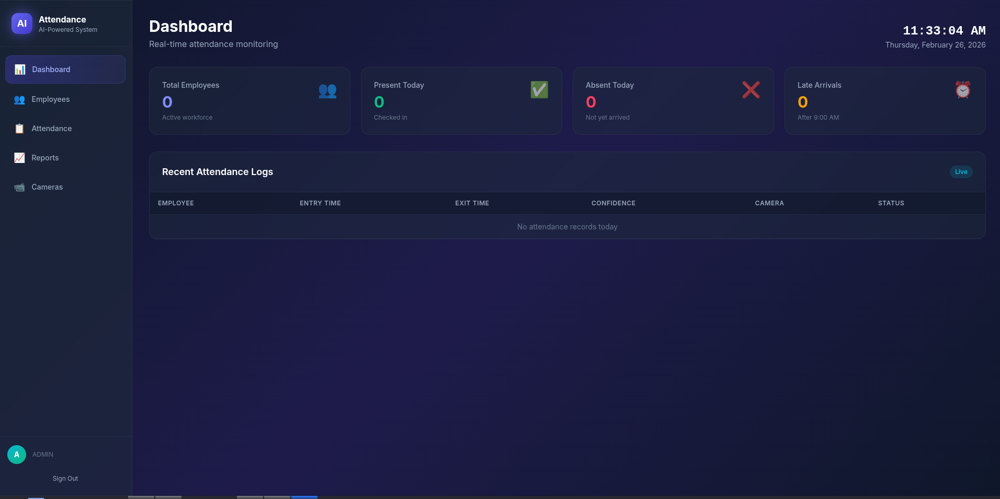
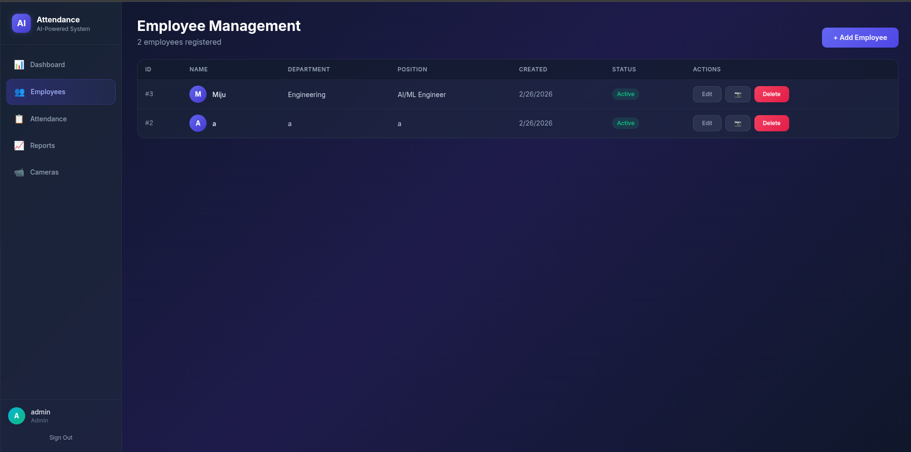
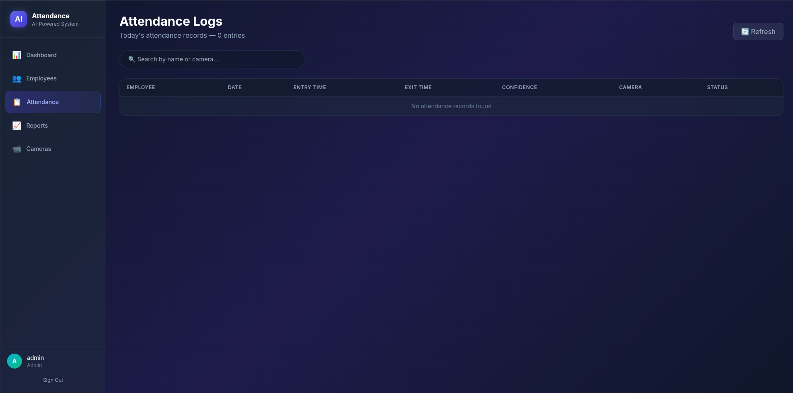
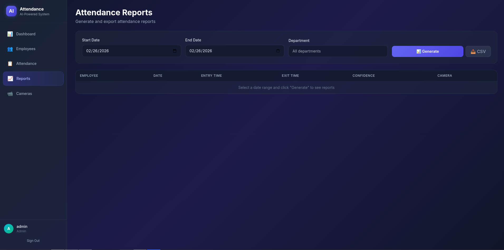
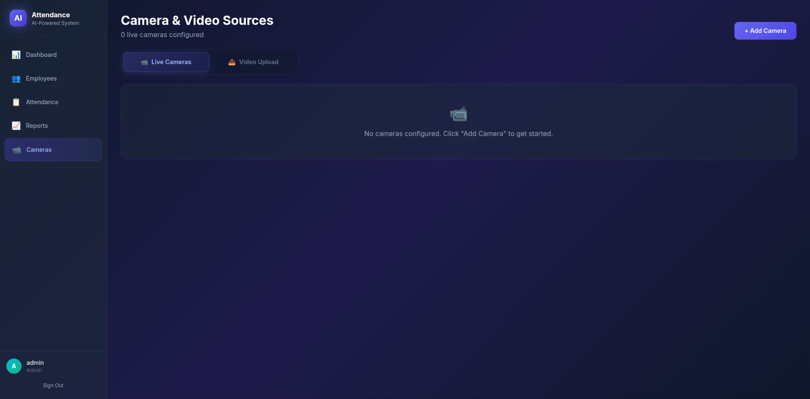

# Attendance AI — AI-Powered Employee Attendance System

A production-level, full-stack employee attendance system integrating a **Python AI script** with a **C# ASP.NET Core** backend and a **React** frontend. The system uses CCTV/video feeds with face recognition to automatically track employee entry and exit times.

## Frontend Views

### Dashboard

The main dashboard provides real-time attendance monitoring with live stats — total employees, present/absent counts, late arrivals — and a scrolling table of recent attendance logs with confidence scores and status badges.

---

### Employees

The employee management page lists all registered employees in a data table with ID, name, department, position, creation date, and status. Supports adding, editing, deleting employees and uploading face images for recognition.

---

### Attendance

The attendance page displays today's attendance records with entry/exit timestamps, confidence levels, and camera source. Filter and search capabilities make it easy to find specific records.

---

### Reports

The reports page allows generating attendance reports for configurable date ranges. Filter by employee or department, and view detailed attendance history with statistics.

---

### Cameras

The camera & video sources page supports two input modes via a tab-based UI:
- **Live Cameras** — Manage RTSP camera feeds with add/edit/delete controls.
- **Video Upload** — Drag-and-drop video file uploads (MP4, AVI, MKV, MOV, etc.) for offline AI processing.

