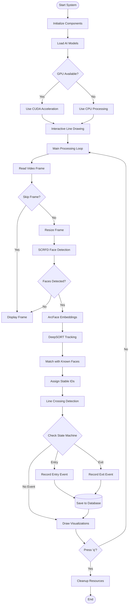
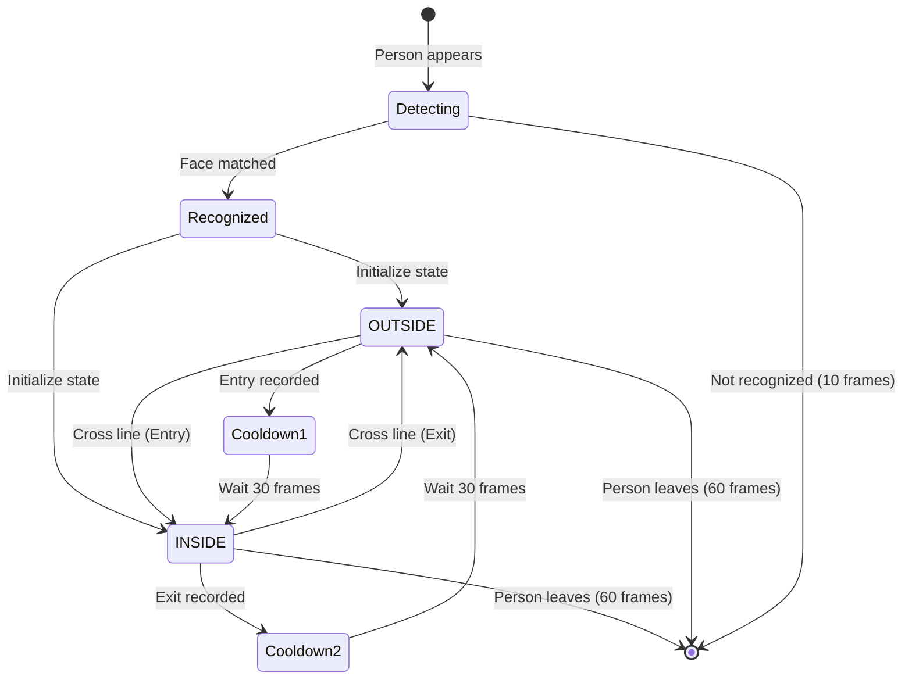
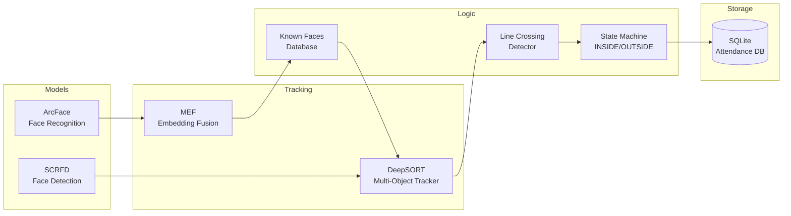
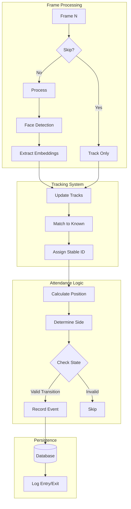
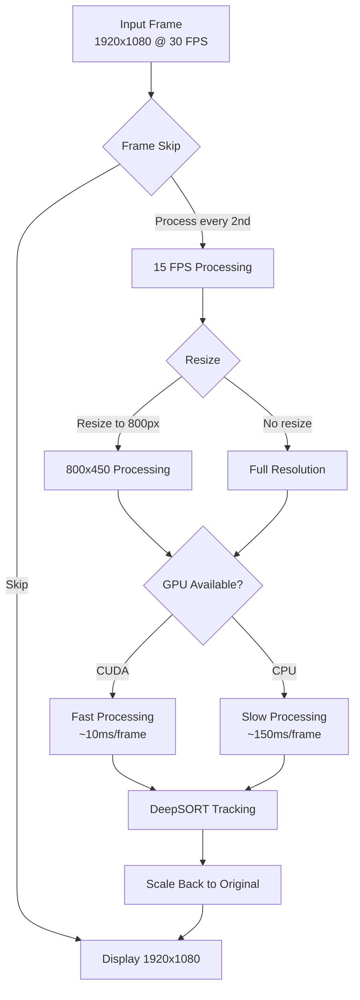

# Entry/Exit Attendance System - Workflow Documentation

## System Architecture



## Detailed Processing Pipeline

```mermaid
flowchart LR
    subgraph Input
        Camera[Camera/Video] --> Frame[Raw Frame]
    end
    
    subgraph Preprocessing
        Frame --> Skip{Skip Frame?}
        Skip -->|Process| Resize[Resize to 800px]
        Skip -->|Skip| Track[Use Existing Tracks]
    end
    
    subgraph Detection
        Resize --> SCRFD[SCRFD Detector]
        SCRFD --> Faces[Face Bboxes + Landmarks]
    end
    
    subgraph Recognition
        Faces --> Align[Face Alignment]
        Align --> ArcFace[ArcFace Model]
        ArcFace --> Embeddings[512D Embeddings]
    end
    
    subgraph Tracking
        Embeddings --> DeepSORT[DeepSORT Tracker]
        Track --> DeepSORT
        DeepSORT --> Tracks[Track IDs]
    end
    
    subgraph Identification
        Tracks --> MEF[Multi-Embedding Fusion]
        MEF --> Compare[Compare with Known Faces]
        Compare --> Identity[Person Name + Stable ID]
    end
    
    subgraph Attendance
        Identity --> Position[Get Position]
        Position --> LineSide[Calculate Line Side]
        LineSide --> StateMachine{State Machine}
        StateMachine -->|OUTSIDE→INSIDE| Entry[Entry Event]
        StateMachine -->|INSIDE→OUTSIDE| Exit[Exit Event]
        Entry --> DB[(Database)]
        Exit --> DB
    end
    
    subgraph Output
        DB --> Visualize[Draw Bboxes + Labels]
        Visualize --> Display[Display Frame]
    end
```



## State Machine Diagram



## Component Interaction



## Data Flow



## Performance Optimization Flow



## Key Parameters

| Parameter | Value | Purpose |
|-----------|-------|---------|
| `PROCESS_EVERY_N_FRAMES` | 2 | Skip frames for speed |
| `RESIZE_WIDTH` | 800 | Processing resolution |
| `FACE_CONFIDENCE` | 0.5 | Detection threshold |
| `FACE_SIMILARITY_THRESHOLD` | 0.40 | Recognition threshold |
| `MIN_TRACK_CONFIDENCE` | 2 | Detections before attendance |
| `ACTIVE_TRACK_GRACE` | 10 | Frames to keep unknown tracks |
| `RECOGNIZED_TRACK_GRACE` | 60 | Frames to keep known tracks |
| `TRACKER_MAX_AGE` | 30 | DeepSORT prediction window |
| `COOLDOWN_FRAMES` | 30 | Frames between entry/exit |

## Database Schema

```
attendance
├── id (INTEGER PRIMARY KEY)
├── person_name (TEXT)
├── event_type (TEXT: 'ENTRY' or 'EXIT')
├── timestamp (DATETIME)
├── confidence (REAL)
└── track_id (INTEGER: Stable ID)
```
